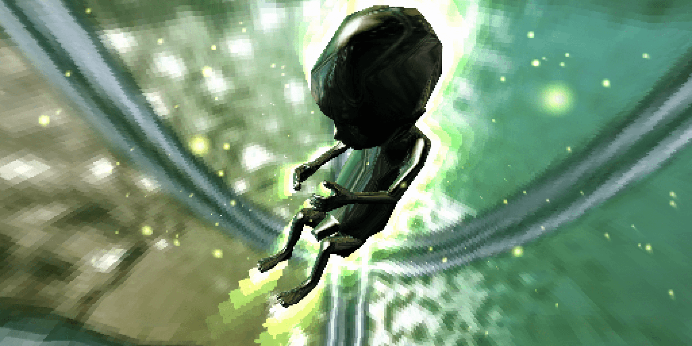

# forward by Komplex (preservation)
Forward Java demo, rebuild from the bytecode, adapted to a more recent JDK and packaged as a standalone binary. Part of my PhD project about demoscene preservation.<br>
_-- fra^mandarine_



## What Has Been Modernized

- removed the `Applet` dependency in favor of an AWT desktop host
- replaced the old `IE3/IE4` / `sun.audio` audio backends with `Java Sound`
- fixed decompiled classes that still contained `GOTO` artifacts
- disabled the intermediate switch to a full-screen window so the whole demo stays in the same desktop window
- retimed the `phorward.gif` scroll in `domina` and `uppol` to a virtual `50 Hz` cadence to avoid speeding up on modern machines
- retimed the frame-driven parts of `mute95` from scene time to limit intro overexposure without breaking warp fluidity
- retimed the frame-driven animations in `watercube` to a virtual `50 Hz` cadence so the center rotation, ripple, and `rok` damping stay aligned with the original binary
- restored the original affine rasterizer for Java materials `3` / `259` to remain source-faithful in `saari`
- locked AWT text rendering to an explicit monospace font with antialiasing disabled so text screens stay consistent between the source launcher and the `jpackage` build

## Prerequisites

- a JDK available in `PATH`

## Launching

From the repository root:

```bat
run_forward_desktop.bat
```

Without interactive launch arguments, the desktop launcher now opens a small startup GUI where you can choose:

- `Windowed`
- `Fullscreen`
- a display resolution loaded from `forward-launcher.ini`
- `1x1 pixel mode`

If `forward-launcher.ini` is missing, the launcher falls back to two built-in choices:

- `Native 512x256`
- `X2 1024x512`

`Fullscreen` keeps a black background across the entire screen and centers the demo at the selected size.
`1x1 pixel mode` matches the original Java binary flag `1x1 1`. It is now enabled by default in the desktop port.

Historical options are still supported:

```bat
run_forward_desktop.bat nosound 1
run_forward_desktop.bat 1x1 1
run_forward_desktop.bat 1x1 0
run_forward_desktop.bat nosound 1 1x1 1
```

Additional desktop options:

```bat
run_forward_desktop.bat launcher 0 displaymode windowed displayscale 2
run_forward_desktop.bat launcher 0 displaymode fullscreen displayscale 1
```

Parameters:

- `launcher 0`: skip the startup GUI
- `displaymode windowed|fullscreen`: force the display mode
- `displayscale 1|2`: change only the final on-screen presentation size
- `1x1 1|0`: force `1x1` mode on or off

The historical `1x1 1` flag still controls the internal rendering mode. `1x1 0` forces the older reduced mode. `displayscale` affects only on-screen presentation.

The script compiles `java-desktop/src/main/java` into `java-desktop/build/classes`, then launches `ForwardDesktopLauncher` using `original/forward` as the working directory so the original assets can be reused.

`forward-launcher.ini` is read from the repository root in the source workflow and can be edited to change the resolution list shown by the startup GUI.

## Win64 Packaging

A `jpackage` workflow is now available to produce a standalone Windows build with an embedded Java runtime:

```bat
package_forward_desktop.bat
```

Default output:

```text
java-desktop\dist\jpackage\app-image\forward-komplex\forward-komplex.exe
```

`forward-komplex.exe` does not require a JDK to be installed on the target machine.
The packaging script also converts `java-desktop/app-icon.png` into a standard Windows `.ico` and embeds it into the packaged launcher.
It also copies `original/forward/README.TXT` and `original/forward/version.txt` next to `forward-komplex.exe`.

The packaged build uses the same launcher GUI as the source build, with the same `displaymode`, `displayscale`, and `launcher 0` options.
The packaging script also copies `forward-launcher.ini` next to `forward-komplex.exe` so the packaged resolution list stays editable after distribution.

Optional Windows installer:

```bat
package_forward_desktop.bat exe
```

Installer generation requires WiX in `PATH`. The plain `app-image` only depends on the JDK.

The detailed workflow is documented in:

- `documentation/forward-jpackage-workflow.md`

## Reference Capture

The desktop build can now capture itself to PNG through `key value` parameters.

Example:

```bat
run_forward_desktop.bat capture documentation\reference-capture\java captureintervalms 2000 capturelimit 60 captureexit 1
```

Capture mode automatically skips the startup GUI. Captures remain in native `512x256` resolution even if interactive display was selected in `x2`.

Ready-to-use wrappers:

```bat
capture_forward_demo.bat
capture_reference_video.bat
```

Outputs:

- `documentation/reference-capture/java/manifest.csv`
- `documentation/reference-capture/java/frames/*.png`
